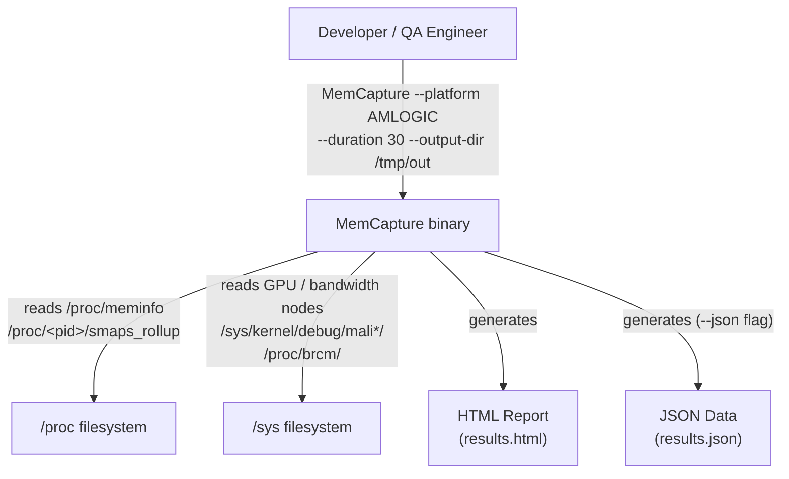
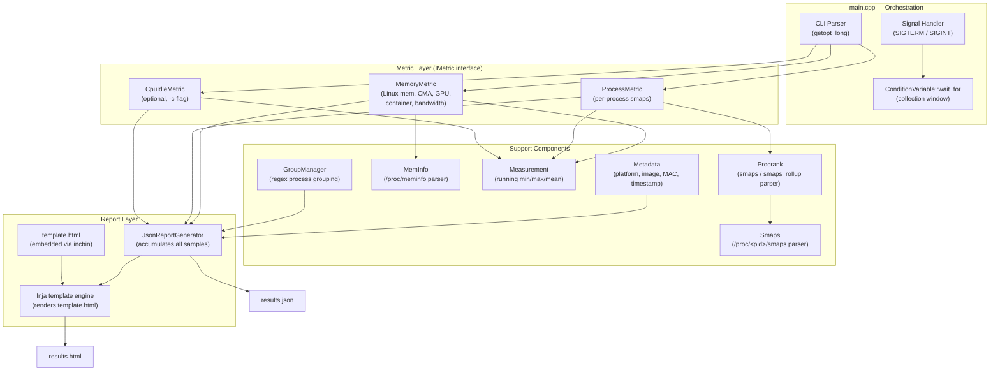
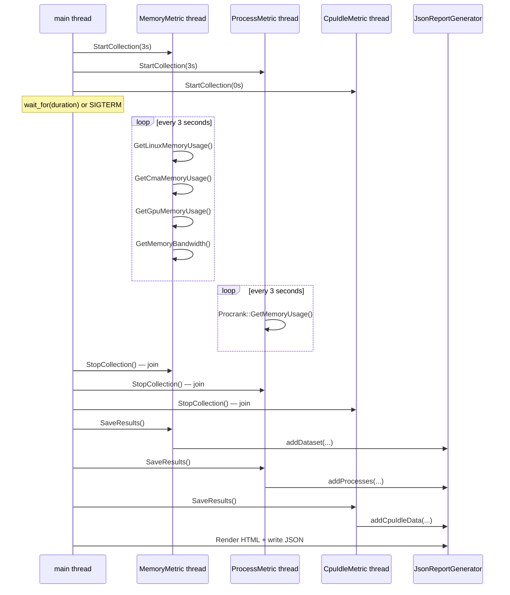
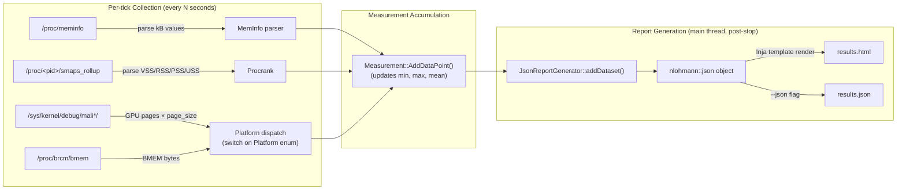
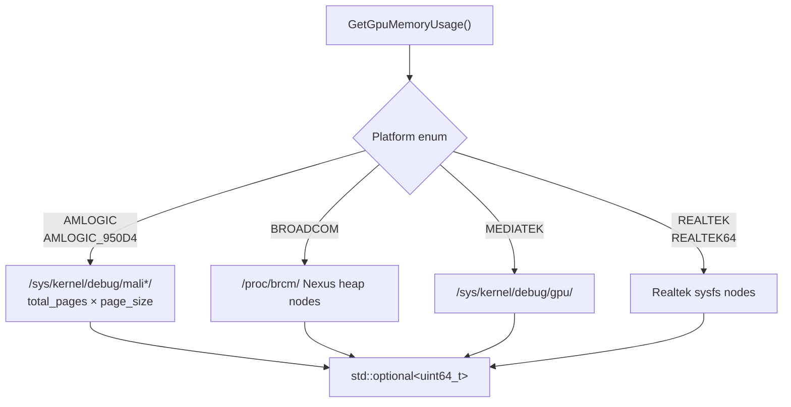
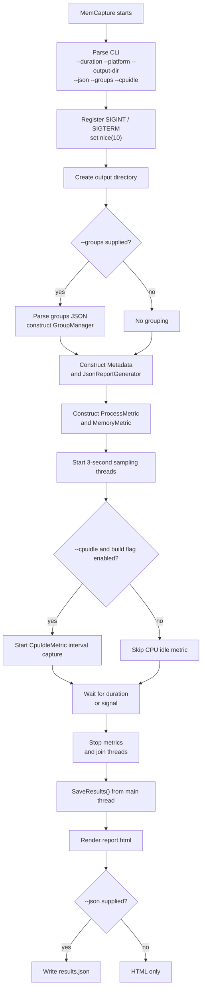
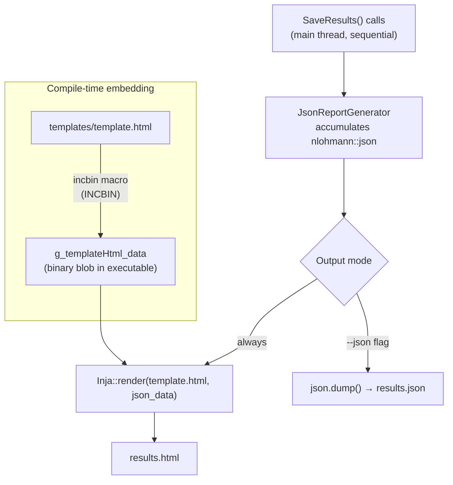
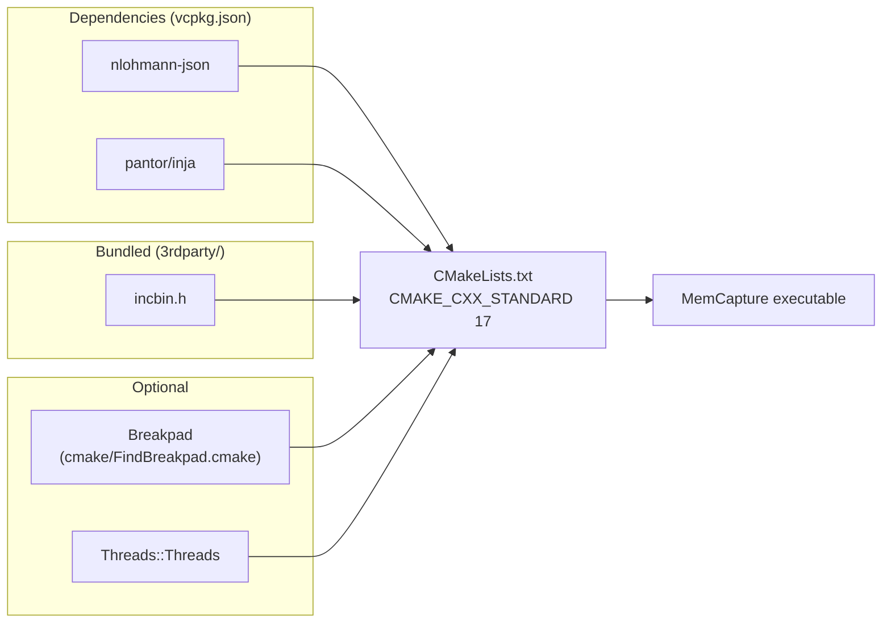
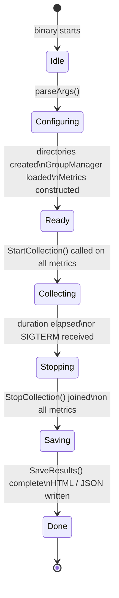

# MemCapture — Architecture Overview

## Overview

MemCapture is a single-binary C++17 utility that captures memory and CPU statistics on RDK set-top
devices across both RDK-E and RDK-V deployments over a configurable duration and emits an HTML report (and optionally a JSON file) containing
min/max/mean statistics for every metric collected. It is designed to run at lowered process priority
so it does not affect the device workload being measured.

The codebase is primarily used on Linux-based RDK device targets and the reporting / collection flow is
applicable to both RDK-E and RDK-V environments. Some metadata fields remain platform-dependent and may
return `"unknown"` on non-device or partially provisioned hosts.

---

## System Context



---

## High-Level Component Diagram



---

## IMetric Interface

Every metric implements the same three-method contract:

```cpp
class IMetric {
public:
    // Start a background collection thread; returns immediately.
    virtual void StartCollection(std::chrono::seconds frequency) = 0;

    // Signal the thread to stop and block until it has joined.
    virtual void StopCollection() = 0;

    // Write accumulated samples into JsonReportGenerator.
    // Called from the main thread only, after StopCollection() returns.
    virtual void SaveResults() = 0;
};
```

---

## Threading Model



### Thread Safety Rules

| Rule | Detail |
|------|--------|
| Each metric owns exactly one `std::thread` | Spawned in `StartCollection()`, joined in `StopCollection()` |
| `mQuit` flag | Must be `std::atomic<bool>`; set by main thread, read by collection thread |
| Collection thread sleep | Uses `ConditionVariable::wait_for()` — handles spurious wakeups |
| `JsonReportGenerator` is not thread-safe | Accessed **only** from the main thread via `SaveResults()`, after all threads are joined |
| Measurement maps | Written only by the owning collection thread; read only by `SaveResults()` after join — no mutex needed |

---

## Data Flow



---

## Platform Dispatch

`MemoryMetric` uses a `switch` on the `Platform` enum to select platform-specific
data sources. All six variants must be handled in every switch statement.



Supported platform strings (passed via `--platform`):

| Enum | CLI string | SoC family |
|------|-----------|------------|
| `Platform::AMLOGIC` | `AMLOGIC` | Meson (default) |
| `Platform::AMLOGIC_950D4` | `AMLOGIC_950D4` | T950D4 variant |
| `Platform::REALTEK` | `REALTEK` | 32-bit Realtek |
| `Platform::REALTEK64` | `REALTEK64` | 64-bit Realtek |
| `Platform::BROADCOM` | `BROADCOM` | BCM / Nexus |
| `Platform::MEDIATEK` | `MEDIATEK` | MediaTek |

---

## Runtime Behavior on RDK-E and RDK-V

MemCapture does not contain a separate `RDK-E` versus `RDK-V` execution path in code. Runtime
behaviour is determined by three things:

1. CLI options passed at startup
2. the selected `Platform` enum (`--platform`)
3. which Linux files and kernel features actually exist on the target device

That means the binary follows the same orchestration model on both stacks, while the set of
successful metrics depends on what the target exposes.

### Common runtime flow



### Runtime behaviour by stack

| Runtime aspect | RDK-E stack | RDK-V stack |
|----------------|-------------|-------------|
| Startup sequence | Same as RDK-V: parse CLI, create output dir, build metrics, start threads | Same as RDK-E |
| Sampling cadence | Same defaults: `ProcessMetric` and `MemoryMetric` every 3 seconds | Same defaults: `ProcessMetric` and `MemoryMetric` every 3 seconds |
| Signal handling | `SIGINT` / `SIGTERM` causes graceful stop and report save | `SIGINT` / `SIGTERM` causes graceful stop and report save |
| Metadata | Uses `/etc/device.properties`, `/version.txt`, `/sys/class/net/eth0/address` when present; may be `Unknown` on generic or partially provisioned hosts | Same file probes; more likely to be populated on full device images |
| Linux / process metrics | Generally available if `/proc/meminfo`, `/proc/<pid>/smaps(_rollup)` exist | Generally available if `/proc/meminfo`, `/proc/<pid>/smaps(_rollup)` exist |
| Container metrics | Available only when `/sys/fs/cgroup/memory` exists and contains useful cgroups | Available only when `/sys/fs/cgroup/memory` exists and contains useful cgroups |
| GPU / multimedia metrics | Only available if platform-specific debug nodes are present on that device | Commonly relevant on multimedia STB SoCs; still gated by file presence |
| CPU idle metrics | Requires `ENABLE_CPU_IDLE_METRICS` build flag and kernel `prctl` idle metrics support | Requires `ENABLE_CPU_IDLE_METRICS` build flag and kernel `prctl` idle metrics support |
| Output files | `report.html` always; `results.json` only with `-j` | `report.html` always; `results.json` only with `-j` |

### What changes in practice between RDK-E and RDK-V

The main behavioral difference is **metric coverage**, not control flow.

| Category | Practical outcome on RDK-E | Practical outcome on RDK-V |
|----------|----------------------------|----------------------------|
| Core Linux memory | Usually available | Usually available |
| Per-process memory | Usually available | Usually available |
| Grouped process reporting | Available when `-g <groups.json>` is supplied | Available when `-g <groups.json>` is supplied |
| Container cgroup accounting | Depends on cgroup layout of the broadband / gateway image | Depends on cgroup layout of the video / device image |
| GPU memory | Often absent on non-multimedia targets or unsupported platforms | Often meaningful on Amlogic / Broadcom / MediaTek / Realtek video devices |
| DDR bandwidth | Only on supported Amlogic-based targets | Only on supported Amlogic-based targets |
| Broadcom BMEM | Only on Broadcom targets | Only on Broadcom targets |
| Fragmentation / buddyinfo | Available only if `/proc/buddyinfo` exists and matches expected column layout | Available only if `/proc/buddyinfo` exists and matches expected column layout |

### Developer interpretation

- Treat MemCapture as a **capability-driven collector** on both stacks.
- If a device lacks the required sysfs or procfs node, the corresponding dataset is skipped or left empty.
- Empty optional datasets are not necessarily failures; they usually mean the platform or image does not expose
    that metric.
- The most portable datasets across RDK-E and RDK-V are `Linux Memory`, `processes`, `metadata`, and optional
    `pssByGroup` when grouping is enabled.
- The least portable datasets are `GPU Memory`, `Memory Bandwidth`, `BMEM`, and some CPU idle features because
    they depend on vendor-specific kernel interfaces.

### Typical runtime examples

**RDK-E-oriented run**

```bash
./MemCapture --platform BROADCOM --duration 30 --json --output-dir /tmp/memcapture_rdke/
```

Expected behaviour:
- starts the same collection threads as any other target
- always attempts Linux memory and process collection
- may populate `BMEM` on Broadcom devices
- may leave GPU or CPU idle datasets empty if the required nodes are absent or disabled

**RDK-V-oriented run**

```bash
./MemCapture --platform AMLOGIC --duration 30 --groups ./groups.example.json --json --cpuidle --output-dir /tmp/memcapture_rdkv/
```

Expected behaviour:
- starts process and memory sampling every 3 seconds
- enables CPU idle interval capture when built with `ENABLE_CPU_IDLE_METRICS`
- can populate Linux memory, CMA, GPU memory, container metrics, fragmentation, and DDR bandwidth on supported images
- writes both `report.html` and `results.json`

### Failure and degradation model

| Condition | Runtime result |
|-----------|----------------|
| Invalid `--platform` | Process exits with failure during argument parsing |
| Invalid `--groups` JSON | Process exits with failure before starting capture |
| Missing output directory permissions | Process exits with failure before capture starts |
| Missing optional metric files | Warning logged; capture continues without that dataset |
| `SIGTERM` / `SIGINT` during capture | Early termination flag set; in-flight collection completes; report still saved |
| CPU idle requested without build support | Error logged; other metrics continue |

This degradation behaviour is the same on both RDK-E and RDK-V stacks and is one of the main reasons
the tool is practical across heterogeneous device families.

---

## Metric Catalogue

### MemoryMetric

Collects system-wide memory statistics every N seconds.

| Sub-metric | Data Source | Platforms |
|-----------|-------------|-----------|
| Linux memory (MemTotal, MemFree, MemAvailable, …) | `/proc/meminfo` | All |
| CMA (CmaTotal, CmaFree) | `/proc/meminfo` | All |
| GPU memory | Platform-specific sysfs / procfs | All (platform dispatch) |
| Container memory | cgroup memory files | All |
| Memory bandwidth | `/sys/class/aml_ddr/bandwidth` | AMLOGIC |
| Memory fragmentation | `/proc/buddyinfo` | All |
| Swap usage | `/proc/meminfo` | All (if swap present) |

#### Linux Memory dataset

Report dataset name: `Linux Memory`

Each row is a named memory category and each row stores `Min`, `Max`, and `Average`
in kilobytes under the `Value_KB` measurement.

| Report row | Source / formula | Meaning for developers |
|-----------|------------------|------------------------|
| `Total` | `MemTotal` from `/proc/meminfo` | Total RAM visible to Linux |
| `Used` | `MemInfo::MemUsedKb()` | Effective Linux-used memory; also copied into `grandTotal.linuxUsage` |
| `Buffered` | `Buffers` | Block-device and filesystem buffer cache |
| `Cached` | `Cached` | Page cache usage; often reclaimable |
| `Free` | `MemFree` | Completely free pages |
| `Available` | `MemAvailable` | Kernel estimate of allocatable memory without swap pressure |
| `Slab Total` | `Slab` | Total kernel slab allocation |
| `Slab Reclaimable` | `SReclaimable` | Slab objects likely reclaimable |
| `Slab Unreclaimable` | `SUnreclaim` | Slab memory not readily reclaimable |
| `Swap Used` | `SwapTotal - SwapFree` | Total swap currently consumed |

Developer note: `Used` is the quickest high-level signal for system pressure, while
`Available` is usually the better predictor of whether the system is close to reclaim
or OOM behavior.

#### CMA datasets

Report dataset names: `CMA Regions`, `CMA Summary`

`CMA Regions` emits one row per region found under `/sys/kernel/debug/cma/`.

| Column | Meaning |
|--------|---------|
| `Region` | Friendly name mapped from kernel CMA directory names |
| `Size_KB` | Total configured size of the CMA region |
| `Used_KB` | Min/Max/Average used pages converted to kilobytes |
| `Unused_KB` | Min/Max/Average free space inside that region |

`CMA Summary` emits two summary rows:

| Report row | Meaning |
|-----------|---------|
| `CMA Free` | `CmaFree` from `/proc/meminfo` |
| `CMA Borrowed by Kernel` | `total unused CMA pages - CmaFree`; indicates CMA space temporarily consumed outside normal reserved use |

Developer note: high `CMA Borrowed by Kernel` values are useful when debugging memory
pressure on devices with large multimedia CMA reservations.

#### GPU Memory dataset

Report dataset name: `GPU Memory`

One row is emitted per process with tracked GPU allocations.

| Column | Meaning |
|--------|---------|
| `PID` | Owning process identifier |
| `Process` | Process name resolved from `/proc` |
| `Container` | Container name if the process belongs to one, otherwise `-` |
| `Cmdline` | Full process command line |
| `Memory_Usage_KB` | Min/Max/Average GPU allocation attributed to that process |

Platform-specific interpretation:

| Platform | Source | Conversion |
|----------|--------|------------|
| AMLOGIC / AMLOGIC_950D4 | `/sys/kernel/debug/mali0/gpu_memory` | pages → bytes → KB |
| MEDIATEK | `/sys/kernel/debug/mali0/gpu_memory` | already reported in KB |
| BROADCOM | `/sys/kernel/debug/dri/0/*/client` | virtual allocation parsed per TID, then attributed back to parent PID |
| REALTEK / REALTEK64 | Realtek-specific sysfs parser | implementation-specific conversion to KB |

Developer note: GPU memory is also added into `grandTotal.calculatedUsage`, so it helps
explain why total calculated device usage may exceed plain Linux-used memory.

#### Containers dataset

Report dataset name: `Containers`

This dataset is built by enumerating directories under `/sys/fs/cgroup/memory` and
reading each container cgroup's `memory.usage_in_bytes` file.

| Column | Meaning |
|--------|---------|
| `Container` | Directory name under `/sys/fs/cgroup/memory` |
| `Memory_Used_KB` | Min/Max/Average memory usage of that cgroup in kilobytes |

Filtering behavior:

| Ignored pattern | Why it is excluded |
|-----------------|--------------------|
| `init.scope` | systemd bookkeeping cgroup |
| `*.slice` | service slice rather than an application container |
| `*.mount` | mount unit, not a workload container |
| `*.scope` | transient scope unit, often not useful as a container boundary |

Developer note: this is cgroup-level memory accounting, not process aggregation. A row in
`Containers` can include multiple processes and may not map 1:1 with the process list.
This dataset is useful when container memory limits or orchestration boundaries matter more
than individual process ownership.

#### Memory Bandwidth dataset

Report dataset name: `Memory Bandwidth`

Supported on Amlogic platforms only. MemCapture enables DDR monitoring via
`/sys/class/aml_ddr/mode`, then parses `/sys/class/aml_ddr/bandwidth`.

| Column | Meaning |
|--------|---------|
| `Memory_Bandwidth_kbps` | Min/Max/Average total DDR bandwidth in KB/s |

Developer note: this is a throughput indicator, not capacity usage. Use it to correlate
frame drops or UI stutter with bursts of DRAM traffic.

#### Memory Fragmentation datasets

Report dataset names: `Memory Fragmentation - Zone <zone-name>`

Each zone from `/proc/buddyinfo` becomes a separate dataset. Each row corresponds to a buddy
allocator order.

| Column | Meaning |
|--------|---------|
| `Order` | Buddy allocation order (0 = single page, 1 = 2 pages, ... ) |
| `Free_Pages` | Min/Max/Average count of free blocks at that order |
| `Fragmentation_%` | Min/Max/Average fragmentation percentage derived from remaining higher-order availability |

Developer note: high fragmentation at larger orders means the system may have enough total
free memory but still fail large contiguous allocations, which is particularly relevant for
multimedia workloads and CMA users.

#### Broadcom BMEM dataset

Report dataset name: `BMEM`

Broadcom devices expose additional reserved memory pool usage via `/proc/brcm/core`.

| Column | Meaning |
|--------|---------|
| `Region` | Broadcom region name parsed from `/proc/brcm/core` |
| `Memory_Usage_KB` | Min/Max/Average used memory for that region, derived from region size and usage percentage |

Developer note: BMEM is Broadcom-specific reserved memory outside the normal Linux page
allocator view, so this dataset helps reconcile device memory consumption that does not show
up clearly in `Linux Memory`.

### ProcessMetric

Collects per-process memory statistics using a custom Procrank implementation.

| Field | Source | Notes |
|-------|--------|-------|
| VSS | `/proc/<pid>/smaps_rollup` | Virtual set size |
| RSS | `/proc/<pid>/smaps_rollup` | Resident set size |
| PSS | `/proc/<pid>/smaps_rollup` | Proportional set size |
| USS | `/proc/<pid>/smaps_rollup` | Unique set size |
| Swap | `/proc/<pid>/smaps_rollup` | Swap usage |

Report JSON section: `processes`

Each process entry contains identity fields plus a full `Min` / `Max` / `Average`
triple for each memory measurement.

| Field | Meaning for developers |
|-------|------------------------|
| `pid` | Process ID captured at collection time |
| `ppid` | Parent PID |
| `name` | Short executable name |
| `cmdline` | Full command line |
| `systemdService` | Owning systemd service if available |
| `container` | Owning container if available |
| `group` | Regex-derived logical group from `GroupManager` |
| `rss` | Resident memory currently mapped into RAM |
| `pss` | Proportional share of shared pages; best metric for ranking process memory cost |
| `uss` | Private, unique memory attributable only to this process |
| `vss` | Virtual address space size |
| `swap` | Total swapped pages for the process |
| `swapPss` | Proportional share of swapped pages |
| `swapZram` | Compressed swap usage when zram-backed swap is in use |
| `locked` | Memory locked into RAM and not swappable |

Deduplication behavior:

- dead short-lived duplicate processes with the same `cmdline` and `ppid` can be collapsed
    so helper scripts like repeated `sleep` do not distort long captures
- duplicates are resolved by keeping the entry with the highest average PSS

Processes can be aggregated into named groups via a JSON config (`--groups`). `GroupManager` matches
process names against regex patterns loaded at startup.

If groups are enabled, the report also includes `pssByGroup`, which sums average PSS across all
processes assigned to the same logical group.

### CpuIdleMetric (optional)

Enabled with `--cpuidle`. Requires kernel cpuidle support (`ENABLE_CPU_IDLE_METRICS` build flag).
Reads per-CPU idle state residency from `/sys/devices/system/cpu/cpu*/cpuidle/`.

Report JSON section: `cpuIdleStats`

Unlike `MemoryMetric` and `ProcessMetric`, CPU idle data is captured as one start/stop interval
rather than sampled every 3 seconds.

| Field | Meaning |
|-------|---------|
| `loadStats.cpu[i].idle.sum` | Total idle time for CPU `i` over the capture window |
| `loadStats.cpu[i].idle.percent` | Percent of capture time CPU `i` spent idle |
| `loadStats.overall.idle.sum` | Sum of all CPU idle time |
| `loadStats.overall.load.sum` | Total running time across all CPUs |
| `loadStats.overall.load.count` | Number of sampled load intervals from the kernel metric block |
| `loadStats.overall.load.percent` | Overall CPU load percentage across the capture window |
| `loadStats.load.lt1ms` ... `gt100ms` | Histogram of contiguous run-time bursts grouped by duration bucket |

Developer note: the load histogram is useful for distinguishing many short scheduler wakeups
from fewer long-running CPU bursts.

---

## Report Generation



`template.html` is embedded at compile time via the `incbin` library so the binary is fully
self-contained — no external template file is needed at runtime.

---

## Build System



**Desktop build (vcpkg):**
```bash
cmake -DCMAKE_TOOLCHAIN_FILE=$VCPKG_ROOT/scripts/buildsystems/vcpkg.cmake \
      -DCMAKE_BUILD_TYPE=Release -B build .
cmake --build build --parallel $(nproc)
```

**Device build:** Yocto recipe consumes the same `CMakeLists.txt`; vcpkg is not used on device.

---

## Lifecycle State Machine



---

## Key Design Decisions

| Decision | Rationale |
|----------|-----------|
| Single self-contained binary | No runtime file dependencies; simplifies deployment to RDK devices |
| `template.html` embedded with `incbin` | Avoids path discovery at runtime; binary works from any directory |
| Per-metric `std::thread` | Simple ownership model; each metric is independently controllable |
| `std::optional<T>` for platform metrics | Absent metrics are omitted from the report rather than reported as zero |
| `JsonReportGenerator` not thread-safe | Simplifies implementation; contract enforces single-writer (main thread post-join) |
| `smaps_rollup` preferred over `smaps` | 3–4× faster than full smaps scan; sufficient for per-process PSS/USS |
| `std::filesystem` for all paths | Portable path construction; `exists()` guards prevent silent open failures |

---

## See Also

- [IMetric.h](../../IMetric.h) — Abstract metric interface
- [Platform.h](../../Platform.h) — Platform enum definition
- [MemoryMetric.h](../../MemoryMetric.h) — System memory metric
- [ProcessMetric.h](../../ProcessMetric.h) — Per-process metric
- [JsonReportGenerator.h](../../JsonReportGenerator.h) — Report accumulator
- [Measurement.h](../../Measurement.h) — Running min/max/mean container
- [GroupManager.h](../../GroupManager.h) — Process grouping by regex
- [CMakeLists.txt](../../CMakeLists.txt) — Build definition
- [Thread Safety Analyzer](./../../../.github/skills/thread-safety-analyzer/SKILL.md)
- [Platform Portability Checker](./../../../.github/skills/platform-portability-checker/SKILL.md)
- [Memory Safety Analyzer](./../../../.github/skills/memory-safety-analyzer/SKILL.md)
