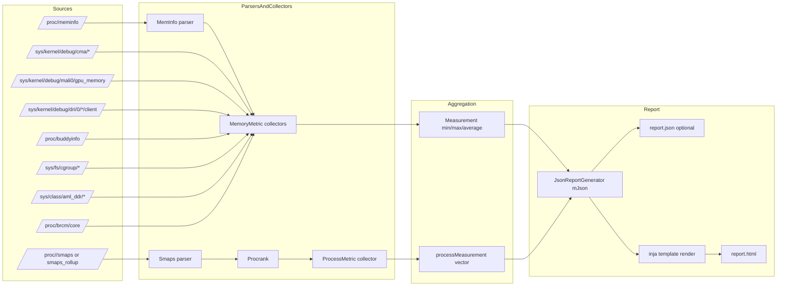

# Data Flow: proc/sysfs to Report Schema

## Evidence

- MemInfo parser entry: `FileParsers/MemInfo.cpp:31`.
- Smaps parser entries: `FileParsers/Smaps.cpp:40`, `FileParsers/Smaps.cpp:87`.
- Procrank uses Smaps for process memory: `Procrank.cpp:165`.
- Measurement accumulation API: `Measurement.cpp:40`.
- Json root object build: `JsonReportGenerator.cpp:92`.
