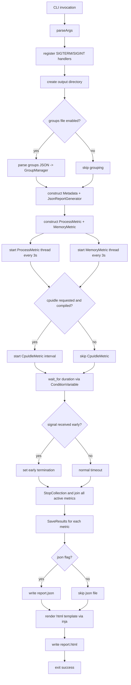

# End-to-End Execution Flow

## Evidence

- `main` orchestration and lifecycle: `main.cpp:179`.
- Metrics started with 3-second frequency: `main.cpp:243`, `main.cpp:244`.
- Wait window uses custom condition variable: `main.cpp:257`, `ConditionVariable.h:135`.
- Stop and save order: `main.cpp:268` through `main.cpp:281`.
- JSON then HTML write sequencing: `main.cpp:327` through `main.cpp:344`.
