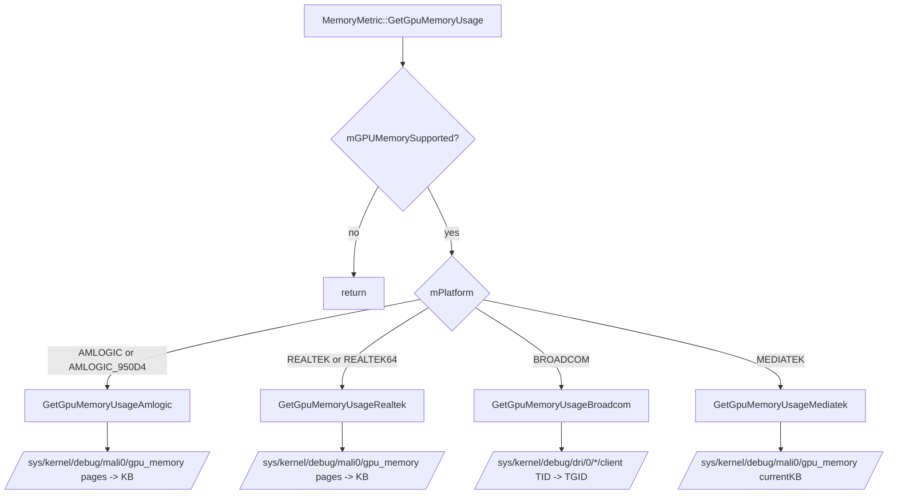

# Platform Dispatch Decision Tree (GPU Memory)

## Evidence

- Dispatch switch: `MemoryMetric.cpp:468` through `MemoryMetric.cpp:493`.
- Amlogic collector: `MemoryMetric.cpp:909`.
- Realtek collector: `MemoryMetric.cpp:1004`.
- Broadcom collector: `MemoryMetric.cpp:825`.
- Mediatek collector: `MemoryMetric.cpp:958`.
- Platform enum values: `Platform.h:22`.
