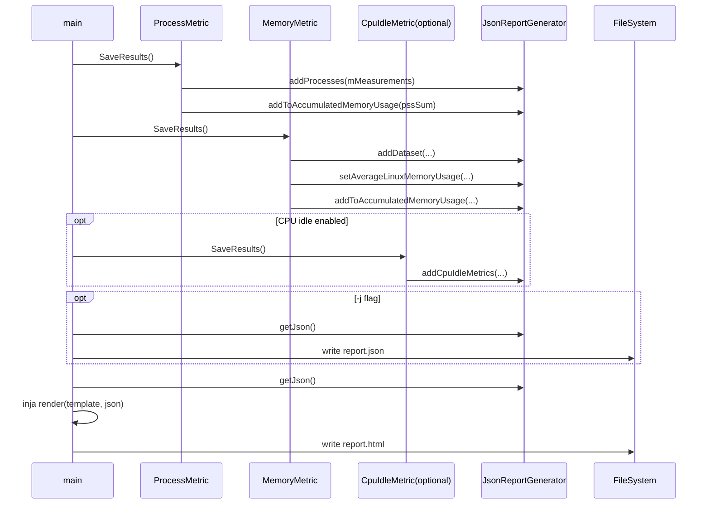

# Report Generation Pipeline Sequence

## Evidence

- SaveResults call sequence in `main`: `main.cpp:277` through `main.cpp:281`.
- JSON write then HTML render/write: `main.cpp:327` through `main.cpp:344`.
- Report generator APIs: `JsonReportGenerator.cpp:38`, `JsonReportGenerator.cpp:92`, `JsonReportGenerator.cpp:106`.
