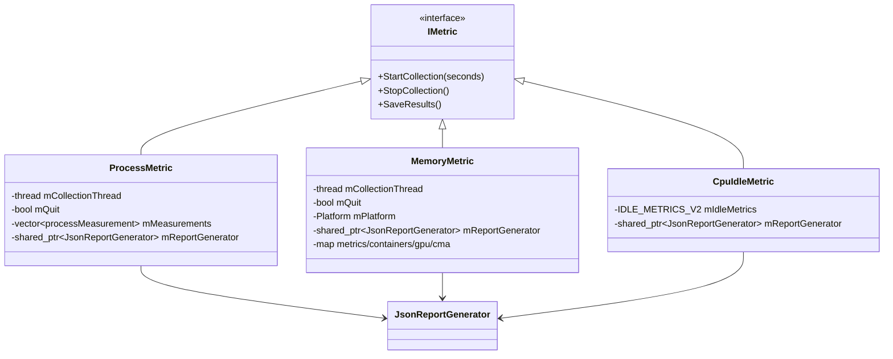

# IMetric Architecture

## Interface Contract

### Facts - Interface

- The interface exposes `StartCollection(std::chrono::seconds)`, `StopCollection()`, `SaveResults()` as pure virtual methods (`IMetric.h:40`, `IMetric.h:45`, `IMetric.h:52`).
- Implementations in this repository are `MemoryMetric`, `ProcessMetric`, and conditional `CpuIdleMetric` (`MemoryMetric.h`, `ProcessMetric.h`, `CpuIdleMetric.h`).

### Inferences - Interface

- The contract intentionally separates collection and serialization phases so report generation can run after thread joins.

## Ownership and Concurrency Model

### Facts - Ownership and Concurrency

- `ProcessMetric` and `MemoryMetric` each own one `std::thread`, `mQuit` flag, mutex, and condition variable (`ProcessMetric.h`, `MemoryMetric.h`).
- `StartCollection` spawns threads; `StopCollection` sets `mQuit`, notifies, and joins (`ProcessMetric.cpp:39`, `ProcessMetric.cpp:45`, `MemoryMetric.cpp:169`, `MemoryMetric.cpp:175`).
- `SaveResults` executes on main thread after stop/join sequencing in `main` (`main.cpp:268` through `main.cpp:281`).
- `JsonReportGenerator` is held by shared pointer in each metric (`MemoryMetric.h`, `ProcessMetric.h`, `CpuIdleMetric.h`).

### Inferences - Ownership and Concurrency

- Thread-safe usage relies on lifecycle ordering rather than internal report-generator locking.

## Class and Ownership Diagram

## Risks and Validation Points

### Unknowns

- `mQuit` is a plain `bool` in metrics; correctness depends on mutex/condition synchronization and join ordering. Thread sanitizer validation is recommended.
